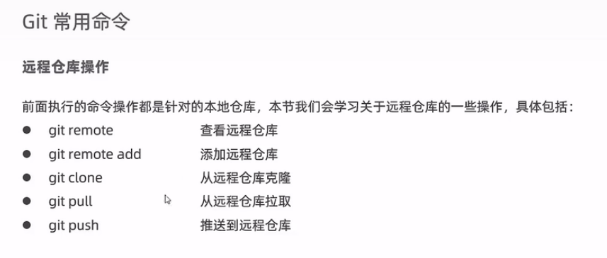

#  git

#  

+ 全局设置

+ git clone 然后加上 

就把远程文件拷贝到本地

+ git init 初始化本地文件

+ 切换版本

+ 提交

##### 远程仓库

+ 

+ 提交

+ 自己创建的git本地仓库连接之后要先拉取
+ $ git pull origin master --allow-unrelated-histories
+ 才能推送信息

##### 分支操作

+ 冲突修改
  

##### 标签操作

+ 检出标签

+ 自己创建的本地项目添加到远程仓库要先

  git pull 

  git pull origin master 

  git pull origin master --allow-unrelated-histories

  合并项目

